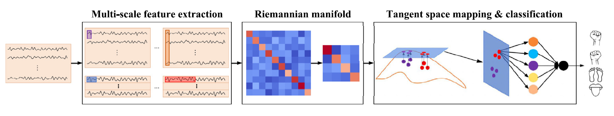

# STaRNet: A spatio-temporal and Riemannian network for high-performance motor imagery decoding
This repository is an **unofficial PyTorch implementation** of the paper "**STaRNet: A spatio-temporal and Riemannian network for high-performance motor imagery decoding**". For more details, please refer to [paper link](https://www.sciencedirect.com/science/article/pii/S0893608024003952).

## Update!
**25.06.11:** Our repository was created!
## Overview



STaRNet is a deep learning model that combines multi-scale feature extraction and Riemannian geometric features for high-performance motor imagery decoding. The model captures multi-scale temporal patterns from EEG signals and projects them onto the Riemannian manifold through covariance matrices. These features are then mapped to the tangent space and effectively fused for classification. The architecture demonstrates superior performance in decoding motor imagery tasks, particularly in the BCI Competition IV 2a dataset.

## Dataset Download

* We downloaded the dataset from the [link](https://www.bbci.de/competition/iv/download/index.html?agree=yes&submit=Submit).
* **Currently, we are providing the converted dataset.**

(Optional) To convert the downloaded dataset, use the following command:
```bash
cd convert_dataset
python transform.py
```


## Prerequisites

* Ubuntu 22.04 (WSL2 possible)
* Docker
* CUDA 11.6.2
* Python 3.10.8


## Installation

1.  **Clone Repository**
    ```bash
    git clone https://github.com/yuhohyun/2025-1_BCI_Project.git
    cd 2025-1_BCI_Project
    ```

2.  **Pull Docker Image**
    Run the following command in your terminal to pull the PyTorch development environment image from Docker Hub.
    ```bash
    docker pull pytorch/pytorch:1.13.1-cuda11.6-cudnn8-devel
    ```

3.  **Run Docker Container**
    Start a container from the pulled image. This command mounts the current project folder into the container's `/workspace` directory and enables GPU access.
    ```bash
    docker run -it --rm --gpus all \
    -v "$(pwd)":/workspace -w /workspace \
    pytorch/pytorch:1.13.1-cuda11.6-cudnn8-devel /bin/bash
    ```

4.  **Install Requirements**
    Inside the running container, install the required Python packages listed in the `requirements.txt` file.
    ```bash
    pip install -r requirements.txt
    ```

## Evaluation
* We conducted our experiments in an NVIDIA RTX A6000.

**Table 1. Average accuracy and kappa values across STaRNet variants on the BCI Competition IV 2a dataset**

| Model            | Subject 1 | Subject 2 | Subject 3 | Subject 4 | Subject 5 | Subject 6 | Subject 7 | Subject 8 | Subject 9 | Avg. acc.        | Avg. kappa       |
|---------------------|-----------:|----------:|----------:|----------:|----------:|----------:|----------:|----------:|----------:|-----------------:|-----------------:|
| **STaRNet (paper)**       |     90.97 |     59.72 |     93.06 |     80.21 |     73.96 |     68.06 |     89.93 |     86.11 |     82.29 | 80.48 (−2.81)    | 0.740 (−0.037)   |

**Experiment result**
| Model               | Subject 1 | Subject 2 | Subject 3 | Subject 4 | Subject 5 | Subject 6 | Subject 7 | Subject 8 | Subject 9 | Avg. acc.        | Avg. kappa       |
|---------------------|-----------:|----------:|----------:|----------:|----------:|----------:|----------:|----------:|----------:|-----------------:|-----------------:|
| **STaRNet (our)**       |     90.97 |     59.72 |     93.06 |     80.21 |     73.96 |     68.06 |     89.93 |     86.11 |     82.29 | 80.48 (−2.81)    | 0.740 (−0.037)   |

## License

This repository is released under the MIT license as found in the [LICENSE](https://github.com/ddongpal/2025-1-bci-project/blob/main/LICENSE) file.   

## Acknowledgement

* I would like to express my deepest gratitude to **Professor Kim Byung Hyung**, who guided this project, and **Teaching Assistant Li Hanyu**, who provided meticulous assistance!
* Special thanks to the authors of the original paper: Xingfu Wang, Wenjie Yang, Wenxia Qi, Yu Wang, Xiaojun Ma, and Wei Wang, for their groundbreaking work on STaRNet.